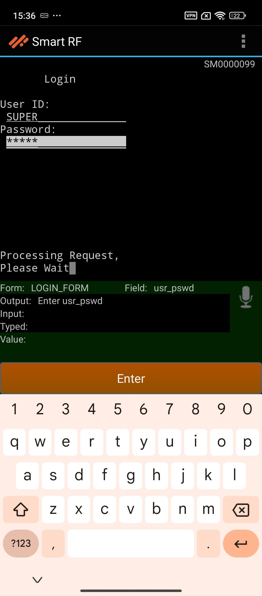

# Smart RF Plus Basic flow

To operate an RF PLUS device, follow these basic steps:

- **Connect the Environment**
   - On the RF PLUS home there will be dropdown to select the environment.
   - Choose the environment for your operations.

   - After selecting the environment, click the "Connect" button.
   

   - This will initiate the connection process to the selected environment.
   - If their is no enviornment shown then click on the **Register Device** and for more information about that Visit [Device Registration](device_registration.md) page.

- **Login Prompt**
   - A login prompt will appear on the screen.
   - Enter the username and password for the selected environment.
   - Ensure the credentials are correct to establish a secure connection.
   - Once the login details are entered, the device will establish a connection to the server.

   

- **Telnet Sesion**
   - A telnet session will be started.
   - The device will automatically input (stuff) the terminal ID retrieved from the QR code along with the username and password provided during login.

   

   - This process ensures that the session is correctly authenticated and associated with the specific device and user.

- **Access Smart RF PLUS Home Screen**
   - After successful authentication and session establishment, the work information page  will be displayed.
   
   - User have to enter their work loaction, warehouse equipment type, after setting up this Smart RF undirected menu will be displayed.

   
   - Users can now access the various features and functionalities of the Smart RF PLUS device, streamlining their warehouse operations.