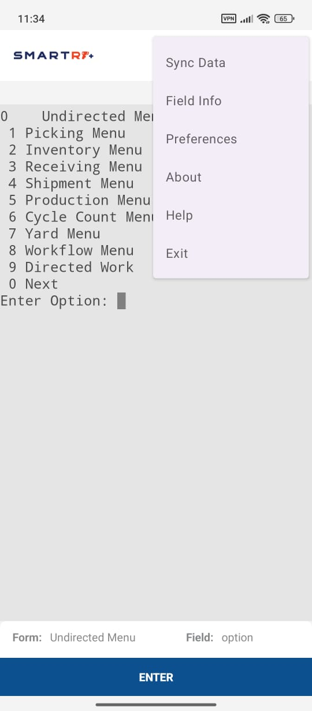
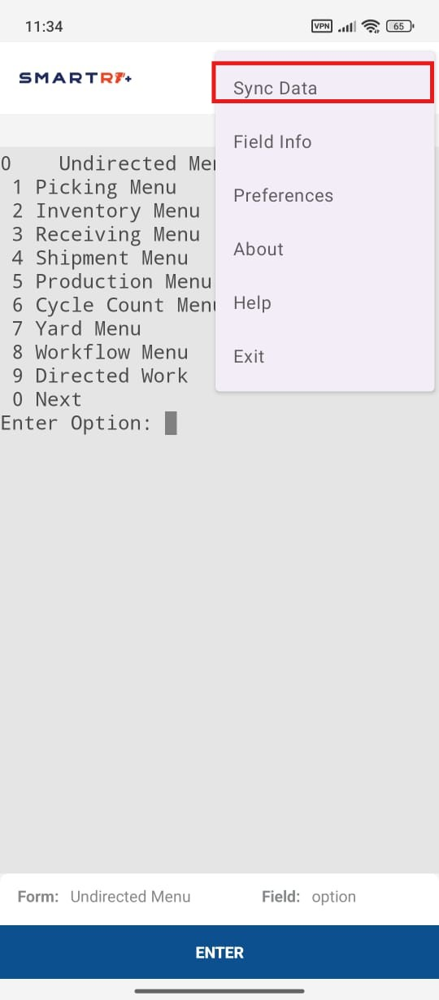
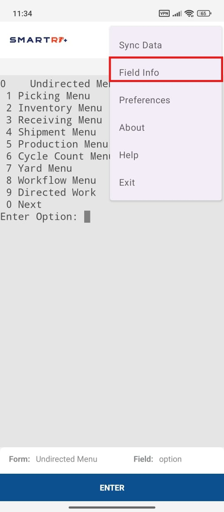
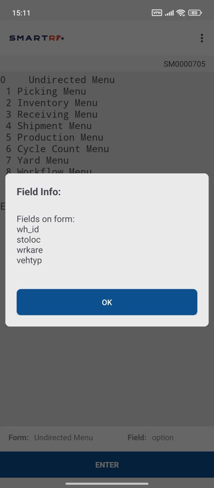
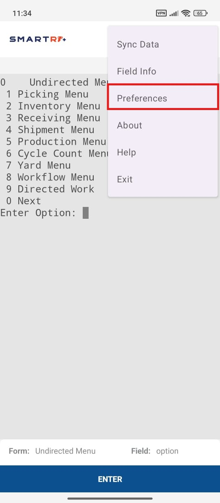
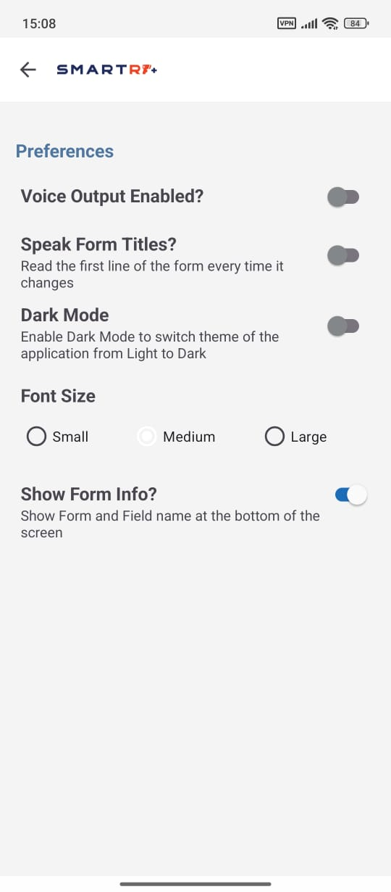
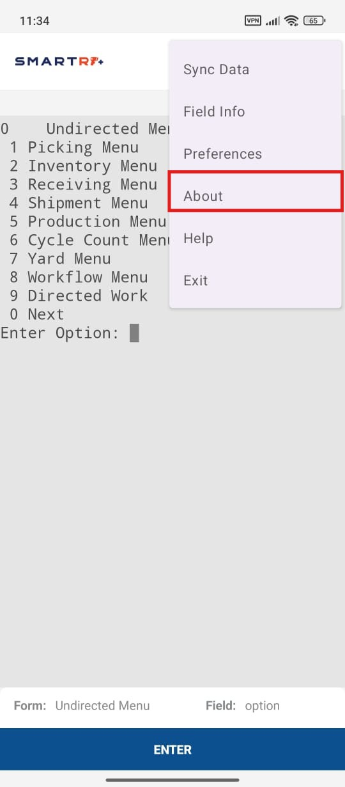
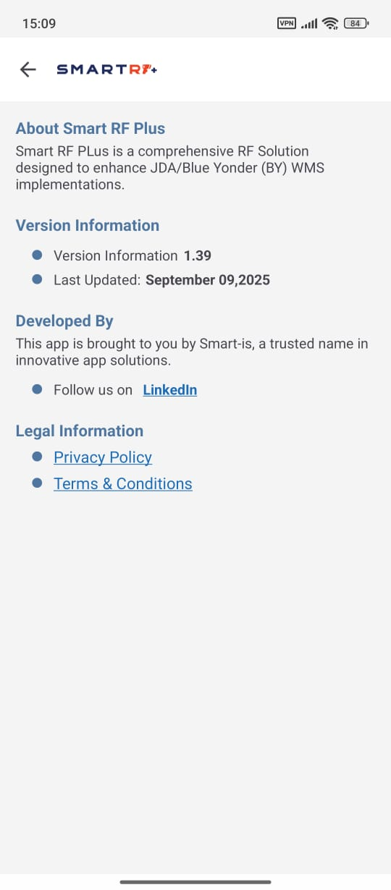
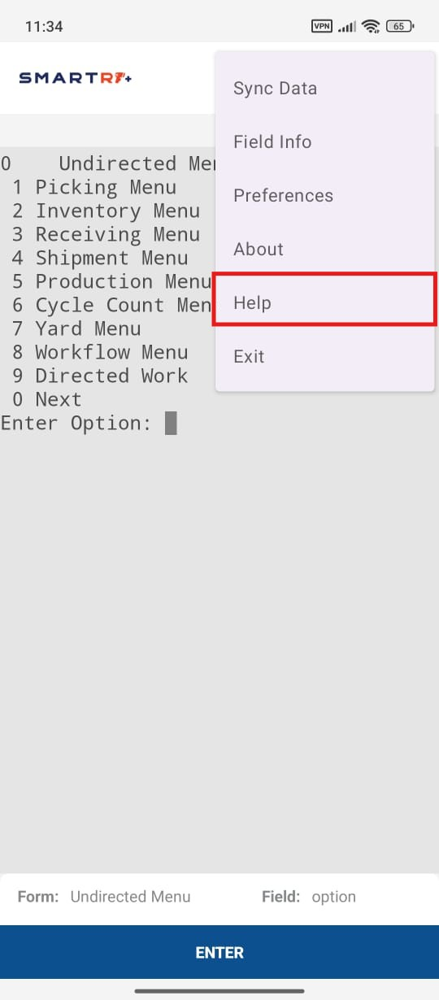
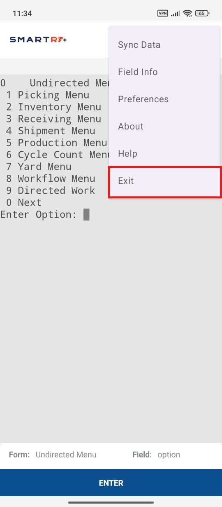

# Smart RF Plus MENU

## Menu

Here we have the following Menu item in our Application

  
  

- From **Sync Data** if you want to sync commands, enviornment and the data you want inside your application at the run time then you can use this option from the Menu bar. 

  

 

- From **Field Info** if you want to check the information regarding any field of the current form then you can use this option from the Menu bar.

  

   - **Field Info** opens a popup displaying the available fields within the form, as illustrated in the image.

  

- From **Preferences** if you want to set output voice control then you can use this option from the Menu bar, by default voice control is set to off.

  

   - **Preferences** provides options to enable dark mode, adjust font size, and view form info using toggle button, as shown in the image.

  

  

- From **About** if you want to get to know about Application, it's version and enviornment on which it is currently working you can use this option from the Menu bar.

  

   - **About** displays application version details and legal information, as depicted in the image.

  

   

- From **Help** if you face any difficulty in operating application and you want any assistence or help so that you can use this option from the Menu bar.

  

- From **Exit** if you want to exit or close your Application you can use this option from the Menu Bar and your Application will be exited Successfully and by again logged In you can persue it from there where you lefted it.

  

