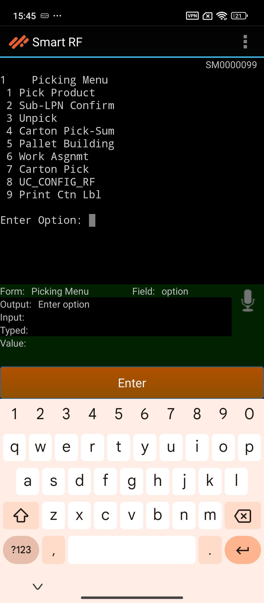
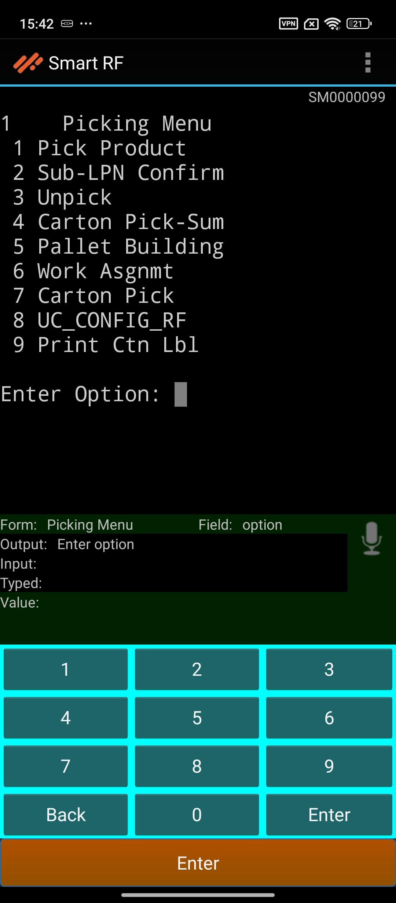
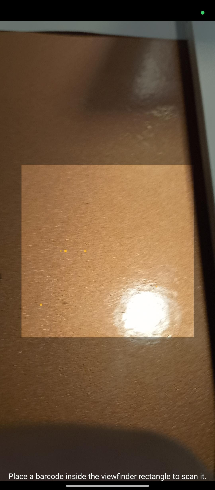

# Navigation

SMART RF PLUS provides intuitive navigation gestures to enhance user experience and efficiency. Below are the key navigation features:

1. **Alphabetic Menu**

- **Swipe from Bottom**: Swiping up from the bottom of the screen will open the default keyboard menu. This menu allows users to input the alphanumeric input for smooth operations.

2. **Default Keyboard**

- **Swipe from Top to Bottom**: Swiping down from the top of the screen will open the device's default mobile keyboard. This feature enables users to input text for searches, data entry, and other functions that require typing.

3. **Camera Access**

- **Swipe from Right**: Swiping left from the right edge of the screen will open the camera interface. This is particularly useful for scanning barcodes, QR codes, enhancing the app's utility in warehouse operations.

4. **Function Keys**

- **Swipe from Left**: Swiping right from the left edge of the screen will reveal the function keys. These keys provide quick access to various functions and shortcuts for the rf devices within the SMART RF PLUS application, improving workflow efficiency.

