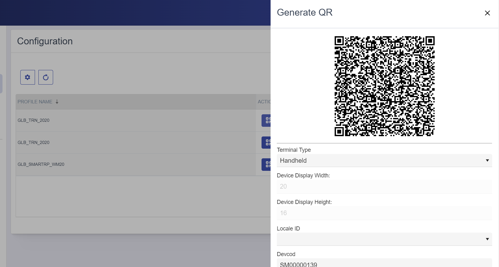

# Registering New Devices

To register a new device with SMART RF PLUS, follow these steps:

1. **Navigate to the Profile Setup**
   - Log in to your SmartApps account.
   - Navigate to the configuration section.
   - In the configuration section, select the profile against which you want to register the new device.
   - Click the action button associated with the selected profile.
    
   - This will open a screen displaying a QR code that contains the required data for device registration, like Device type its dimension
       

2. **Open the SMART RF PLUS App on Your Android Device**
   - On your Android device, open the SMART RF PLUS app.
   - Click on the "Register Device" Button.

   - Use the SMART RF PLUS app to scan the QR code displayed on your profile setup screen.

 
   - This will automatically register your device with the selected profile setup.
   - Your profile will be display in the under the environment section of the smart RF Plus home page screen.
   

By following these steps, you can easily register new devices, ensuring they are configured correctly and ready for use with SMART RF PLUS.
