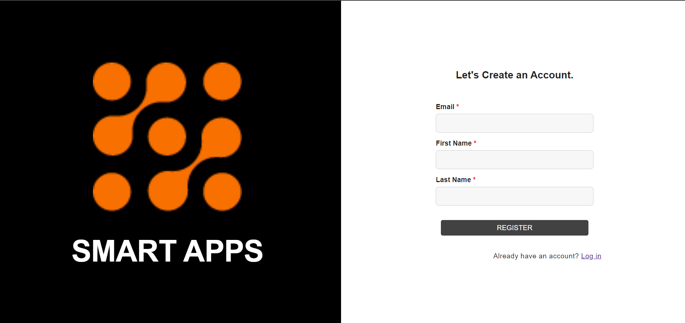
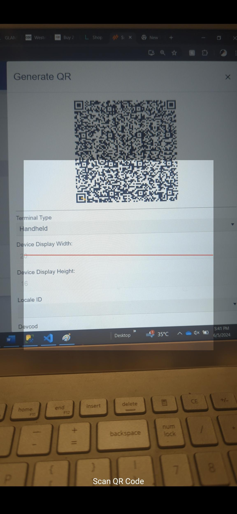

# Smart Apps Setup

## Overview

The Smart Apps Setup for Smart RF PLUS involves defining the necessary MTF  parameters to ensure smooth operation. This setup includes the execution of a script to create up to 5,000 devices, identified by IDs ranging from SM00001 to SM05000. By pre-creating these device IDs, the system avoids frequent task restarts, streamlining the registration process and ensuring efficient device management.

## Enabling Smart RF PLUS

To use Smart RF Plus, users need to register themselves on the SmartApps platform and subscribe to the Smart RF PLUS feature. Follow these steps:

1. **Register on SmartApps**:
   - Visit the [SmartApps registration page](https://apps.smart-is.com/).
   - Fill out the registration form with the required information.
   - Verify your email address to complete the registration process.

# Registering New Devices

To register a new device with SMART RF PLUS, follow these steps:
-  Sign up
- Subscribe
- Profile Group
- Profile Setup

# Sign Up and Subscribe

Before setting up profile groups, users need to sign up for SmartApps and subscribe to the Smart RF PLUS feature.

## Sign Up on SmartApps

1. **Visit the SmartApps Registration Page**
   - Go to [SmartApps Registration](https://apps.smart-is.com/register).

2. **Fill Out Registration Form**
   - Provide the required information such as name, email.
   - Complete the registration form and submit it.

   

3. **Verify Your Email**
   - Check your email for a verification link.
   - Click the verification link to activate your SmartApps account.

## Subscribe to Smart RF PLUS Feature

1. **Log In to SmartApps**
   - Log in to your SmartApps account with your credentials.
   

2. **Product Subsription**
   - After Logging in product page will be displayed.
 Select the Smart RF PLUS feature and click subscribe Button.
   
3. **Select Smart RF PLUS**
   - Click on the RF Plus Plus from the product list.
   - Click on it and follow the prompts to subscribe.

4. **Complete Subscription**
   - Provide any necessary payment information.
   - Confirm and complete the subscription process.
 
   - After clicking on confirmation promt will appear read it and acknowledge to smart-is policy. And click on th submit button.
   

5. **Subscribe to Smart RF PLUS**:
   - After subscribing Smart Rf plus feature will appear in your menu

# Profile Group 

Smart RF PLUS allows users to create and manage profile groups, which organize multiple profiles for different instances. This section outlines how to set up profile groups, define profiles, and configure profile setups.

## Creating a Profile Group

1. **Navigate to Profile Group Section**
   - Log in to your SmartApps account.
   - Navigate to the profile group section.

2. **Create a New Profile Group**
   - Click the "Create Profile Group" button.
   - Enter a name for the new profile group.
   - Save the profile group.

       

## Profiles

Once you have created a profile group, you can define profiles within that group. Each profile corresponds to a specific instance.

1. **Select a Profile Group**
   - In the profile group section, select the profile group where you want to add profiles.

2. **Add a New Profile**
   - Click the "Add Profile" button.
   - Enter the profile name and details.
   - Define the instance associated with this profile.
   - Save the profile.

   

## Profile Setup

After defining profiles, you need to configure the profile setup for each profile. This involves specifying the host, port, and warehouse ID (wh_id).

1. **Select a Profile for Setup**
   - Navigate to the profile setup section.
   - Select the profile you want to configure.

2. **Define Profile Setup Details**
   - Enter the host information.
   - Specify the port number.
   - Input the warehouse ID (wh_id) where the profile will operate.
   - Save the profile setup.
    
    Go to the configuration screen, click on the actions against the profile setup that you have created. It will generate the QR code. You can change the termial type.
       

2. **Open the SMART RF PLUS App on Your Android Device**
   - On your Android device, open the SMART RF PLUS app.
   - Click on the "Register Device" Button.

   - Use the SMART RF PLUS app to scan the QR code displayed on your profile setup screen.

 
 
   - This will automatically register your device with the selected profile setup.
   - Your profile will be display in the under the environment section of the smart RF Plus home page screen.
   

By following these steps, you can easily register new devices, ensuring they are configured correctly and ready for use with SMART RF PLUS.
