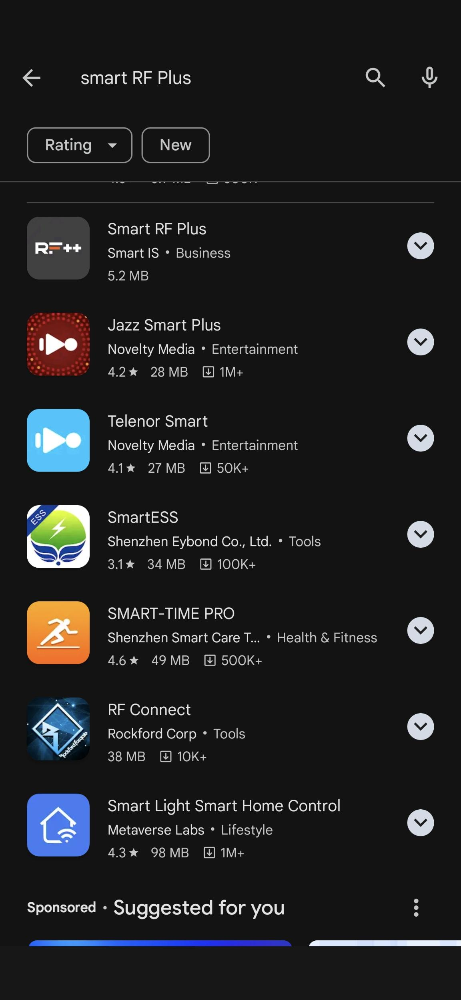

# Getting Started with Smart RF Plus

## How to Download from Playstore

- **Open Google Play Store**
   - On your Android device, open the Google Play Store app.

- **Search for Smart RF Plus**
   - In the search bar at the top, type "Smart RF Plus" and press enter.
   

  
  

- **Install the App**
   - From the search results, find the Smart RF Plus app developed by Smart IS.
   - Tap on the app and then tap the "Install" button.
   - The app will download and install on your device.
   

  
  

  

- **Open the App**
   - Once installed, tap "Open" to launch the Smart RF Plus app.
   - You can also find the app icon on your home screen or in the app drawer.

## Direct Download Link from Smart IS Website

In addition to the Play Store, you can also download the Smart RF Plus app directly from the Smart IS website. Follow these steps:

- **Scan the QR Code**
   - Scan the following QR code to be directed to the Smart-is Smart RF Plus download page:
   
   

  
   

- **Visit the Smart-IS Website**
   - You can  go to [Smart IS Website](https://www.smart-is.com/what-we-do/smart-product/rf/).

- **Download the App**
   - Click on the direct download link to download the Smart RF Plus APK file.
   - Once downloaded, open the file to install the app on your Android device.

- **Follow Installation Prompts**
   - Follow the on-screen prompts to complete the installation.

By following these steps, you can easily get started with Smart RF Plus and enhance your warehouse operations with a robust RF solution.