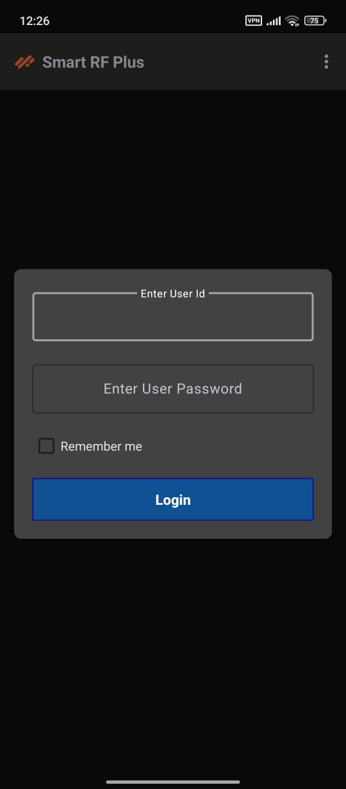
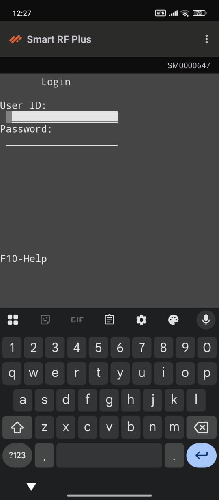
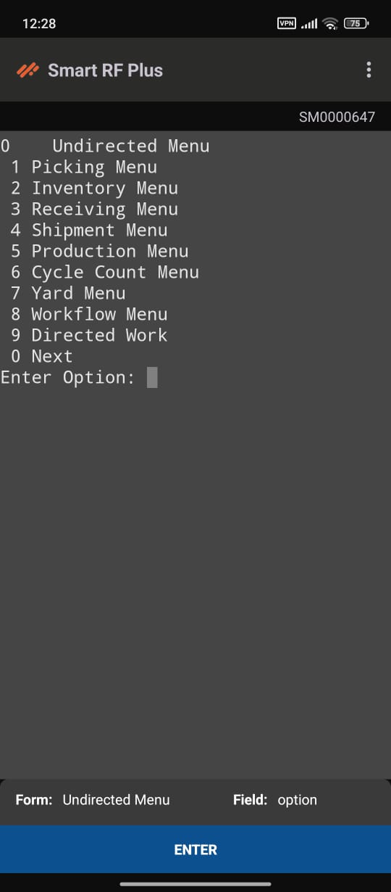

# SMART RF PLUS Quick Start

In this section, we’ll walk you through the steps to quickly set up Smart RF Plus. You'll learn how to get started efficiently and configure it for optimal performance. 

## Prerequisite

- **MTF Server Task Reservation**
  - Reserve a task for Smart RF Plus (existing or new).

- **Server Configurations**
  - Specify the MTF protocol (SSH or Telnet):
    - For Telnet: `-N Telnet`
    - For SSH: `-N SSH`
  - Add debug parameters: `-G22,1`

## Sign Up and Subscribe
- ### Sign up to Smart RF Plus
 
   - Go to [SmartApps Registration](https://apps.smart-is.com/register).
   - Fill out the registration form with your name and email, then submit.

   

    
   

   - Check your email for a verification link.
   - Click the verification link to activate your SmartApps account.

   - Login Through your Credentials.
   

    
   

- ### Subscribe to Smart RF PLUS
   - Log in to your SmartApps account.
   - Navigate to the product subscription page.
   - Select Smart RF PLUS from the list and follow the prompts to subscribe.

For detailed instructions, please refer to the [Subscribe to Smart RF PLUS Feature](device_registration.md#subscribe-to-smart-rf-plus-feature) section 

## Profile Group Setup

Profile groups in Smart RF Plus allow you to organize multiple profiles, each representing a different instance. This helps in managing configurations efficiently.

   

   
   

   For detailed instructions, please refer to the [Profile Group](device_registration.md#profile-group) section.

## Defining Profiles within the Group

Profiles represent specific instances within a profile group. Each profile can be configured to connect to different environments.

   

   
   

   For detailed instructions, please refer to the [Profile Details](device_registration.md#profiles) section.

## Profile Setup

After defining profiles, you need to configure the profile setup for each profile. This involves specifying the host, port, and warehouse ID (wh_id).

   

   
   

   For detailed instructions, please refer to the [Profile Setup Details](device_registration.md#profile-setup) section.

- **Generate QR Code for Profile**
   - Click on actions against the profile setup to generate a QR code.

   

   
   

## Download and Install Smart RF Plus

- **From Google Play Store**
   - Open Google Play Store on your Android device.
   - Search for "Smart RF Plus" and install the app.

   
   

  
  
   

   - Select Application

   

  
  
   

- **Direct Download from Smart IS Website**
   - Scan the QR code below to go to the Smart RF Plus download page:
     
   

     
  
   

     
   - Or visit [Smart IS Website](https://www.smart-is.com/what-we-do/smart-product/rf/).

## Registering New Devices

- **Open the SMART RF PLUS App on Your Android Device**
   - On your Android device, open the SMART RF PLUS app.
   - Click on the "Register Device" Button.

   

   
  
   

- **Scan the QR Code**
   - Use the SMART RF PLUS app to scan the QR code displayed on your profile setup screen.

   

  
  
   

   - This will automatically register your device with the selected profile setup.
   - Your profile will be displayed under the environment section of the Smart RF Plus home screen.

-  **Running script for the bulk devices**
    -  You can run a script on your MOCA system to register multiple devices in bulk. This process helps to avoid the need to restart the task for each individual device registration, streamlining the overall setup.
    For detailed instructions, please refer to the [SQL Script for Device and RF Terminal Creation](concepts.md#what-does-it-need-on-the-server) section.

## Connecting to the Environment

- **Connect the Environment**
   - On the RF PLUS home screen, select the environment from the dropdown.
   - Click the "Connect" button to initiate the connection.
   

   

  
  
   

- **Login Prompt**
   - Enter the username and password for the selected environment.
   - Ensure the credentials are correct to establish a secure connection.
   
   

  
  
   

- **Telnet Session**
   - A telnet session will start, automatically inputting the terminal ID from the QR code along with the login credentials.
   
   

  
  
   

- **Access Smart RF PLUS Home Screen**
   - The work information page will be displayed.
   - Enter your work location and warehouse equipment type. 
   
   

  
  
   

   
   - The Smart RF undirected menu will then appear. 

   

  
  
   

   - You can now access various features and functionalities of the Smart RF PLUS device.

**By following above steps, you can quickly get started with Smart RF Plus and enhance your warehouse operations.**
