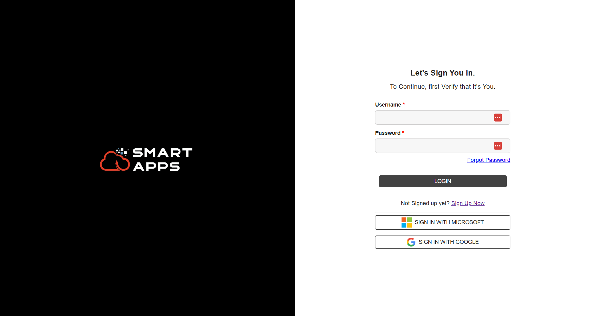
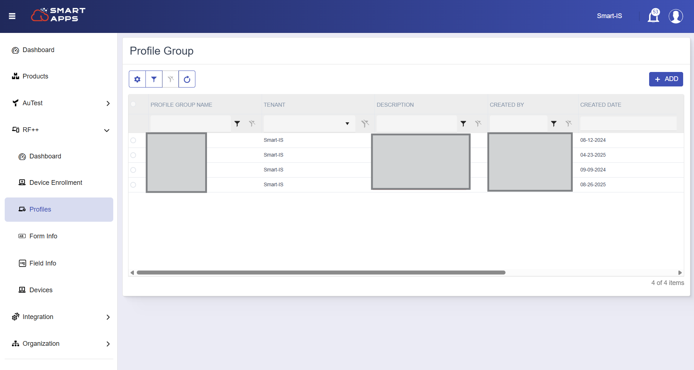
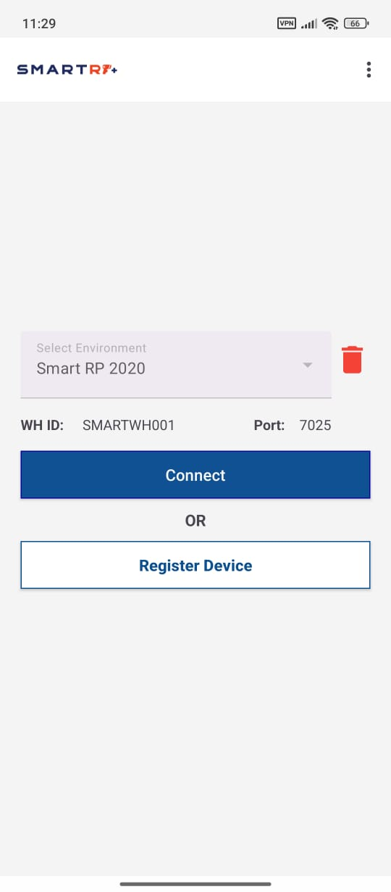
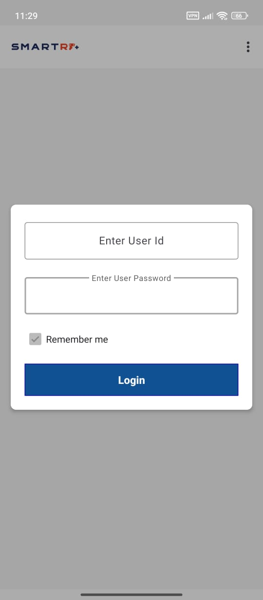

# SMART RF PLUS Quick Start

In this section, we’ll walk you through the steps to quickly set up Smart RF Plus. You'll learn how to get started efficiently and configure it for optimal performance. 

## Prerequisite

- **MTF Server Task Reservation**
  - Reserve a task for Smart RF Plus (existing or new).

- **Server Configurations**
  - Specify the MTF protocol (SSH or Telnet):
    - For Telnet: `-N Telnet`
    - For SSH: `-N SSH`
  - Add debug parameters: `-G22,1`

## Install the Smart RF Plus Application

- **From Google Play Store**
   - Open the Google Play Store on your mobile device.
   - In the search bar, type “Smart RF Plus”.

   
   

  
  
   

   - From the search results, select the Smart RF Plus Application.

   

  
  
   

   - Tap Install and wait for the installation to complete.

 Once installed, tap the Smart RF Plus icon to launch the app.

## Sign Up and Subscribe

On first launch, the app will prompt you to scan a QR code.
To obtain the QR code:

- ### Sign up to Smart RF Plus
 
   - Open Google Chrome and go to [SmartApps Registration](https://apps.smart-is.com/register).
   - Sign in using your username and password, or use your Microsoft account.

   

   
   

   - If you don’t have an account, click Sign Up to create one.
   - For first-time signup, request a tenant assignment by contacting your organization.

   

   
   

   - After logging in, you’ll see the Smart Apps Dashboard.

- ### Subscribe to Smart RF PLUS
   - Navigate to the product subscription page.
   - Select Smart RF PLUS from the list and follow the prompts to subscribe.
   - From the menu, select RF++ to open the RF++ section.

For detailed instructions, please refer to the [Subscribe to Smart RF PLUS Feature](device_registration.md#subscribe-to-smart-rf-plus-feature) section 

## Profile Group Setup

Profile groups in Smart RF Plus allow you to organize multiple profiles, each representing a different instance. This helps in managing configurations efficiently.

   

   
   

   For detailed instructions, please refer to the [Profile Group](device_registration.md#profile-group) section.

## Defining Profiles within the Group

Profiles represent specific instances within a profile group. Each profile can be configured to connect to different environments.

   

   
   

   For detailed instructions, please refer to the [Profile Details](device_registration.md#profiles) section.

## Profile Setup

After defining profiles, you need to configure the profile setup for each profile. This involves specifying the host, port, and warehouse ID (wh_id).

   

   
   

For detailed instructions, please refer to the [Profile Setup Details](device_registration.md#profile-setup) section.

## Device Enrollment & QR Code Generation

- **Generate QR Code for Profile**
   - From the menu, go to Device Enrollment.
   - Select the device and click the QR icon to generate a QR code.
   - From the Terminal Type dropdown, choose either Handheld or Vehicle.

 

## Connecting the Mobile Application

- **Smart RF Plus Application**
   - Open the Smart RF Plus app on your mobile device.

   

   
  
   

- **Scan the QR Code**
   - Scan the QR code generated in Smart Apps.

   

   
  
   

   
   - A confirmation popup will appear “Connection Updated Successfully”
   - This will automatically register your device with the selected profile setup.

-  **Running script for the bulk devices**
   -  You can run a script on your MOCA system to register multiple devices in bulk. This process helps to avoid the need to restart the task for each individual device registration, streamlining the overall setup.
    For detailed instructions, please refer to the [SQL Script for Device and RF Terminal Creation](concepts.md#what-does-it-need-on-the-server) section.

## Connecting to the Environment

- **Connect the Environment**
   - On the RF PLUS home screen, Select the desired Environment.
   - Click the "Connect" button to initiate the connection.
   

   

   
  
   

- **Login Prompt**
   - Enter the username and password for the selected environment.
   - Ensure the credentials are correct to establish a secure connection.
   
   

   
  
   

- **Telnet Session**
   - A telnet session will start, automatically inputting the terminal ID from the QR code along with the login credentials.
   
   

   
  
   

- **Access Smart RF PLUS Home Screen**
   - The work information page will be displayed.
   - Enter your work location and warehouse equipment type. 
   
   

   
  
   

   
   - The Smart RF undirected menu will then appear. 

   

   
  
   

   - You can now access various features and functionalities of the Smart RF PLUS device.

By following above steps, you can quickly get started with Smart RF Plus and enhance your warehouse operations.
