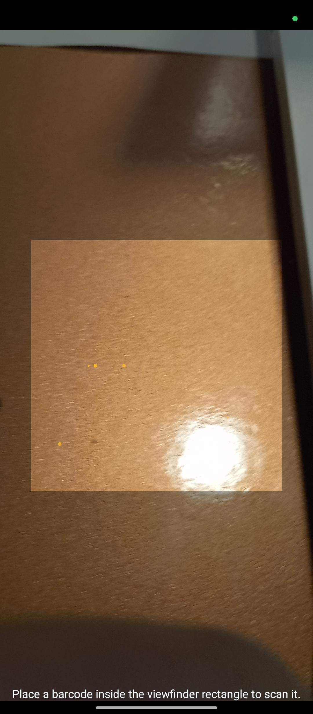

# Scanning

Smart RF PLUS supports efficient scanning functionalities to streamline warehouse operations. Below are the key scanning features:

## Connect a Bluetooth Scanner

- **Step-by-Step Guide**:
  1. Ensure your Bluetooth scanner is powered on and in pairing mode.
  2. Ensure Your mobile Bluetooth is  on and in pairing mode.
  4. Find your scanner in the list of available devices and select it to pair.
  5. Once paired, the scanner will be ready for use within the app.

- **Screenshots**:
  
- **Video Demonstration**:
  [(https://www.youtube.com/watch?v=266QsujVE1Y)]

## Swipe from Right for Camera Scanning

- **Step-by-Step Guide**:
  1. Open the Smart RF PLUS app on your Android device.
  2. Swipe left from the right edge of the screen to open the camera interface.
  3. Position the barcode or QR code within the camera frame.
  4. The app will automatically detect and scan the code, displaying the relevant information on the screen.

- **Screenshots**:
 

